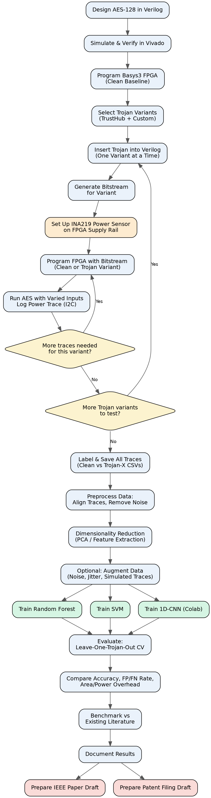

# HardwareTrojanML

Hardware Trojan detection on FPGA-based AES-128 using power side-channel analysis and machine learning.

**Group No:** ECSc_14
**Members:** Adyasha Mohanty, Ayush Anand, Ayushman Mahapatra, Bidisha Jana
**Supervisors:** Professor Swati Swayamsiddha & Professor Kananbala Ray
**School of Electronics Engineering, KIIT Deemed to be University**

---

## What This Project Is

Chips today are designed in one place and fabricated in another, often
untrusted, factory. A bad actor at that factory can secretly insert a
**Hardware Trojan (HT)** — extra malicious circuitry that stays dormant
during normal use and activates only under a rare, attacker-chosen
trigger. Once triggered, it can leak secrets, corrupt data, or disable
the chip.

Normal functional testing can't catch this, because the Trojan behaves
exactly like a clean chip until triggered. This project instead watches
the chip's **power consumption pattern** — even a dormant Trojan draws a
tiny bit of extra power just by existing on the chip — and trains
**machine learning models** to tell a clean circuit apart from a
Trojan-infected one, using only that power signature.

**Target platform:** AES-128 encryption circuit on a Xilinx Artix-7
(Basys3) FPGA.
**Models:** Random Forest, SVM, and a lightweight 1D-CNN.
**End goal:** A working detection framework validated on real hardware,
aimed at an IEEE publication and a patentable detection methodology.

---

## Repo Structure

```
HardwareTrojanML/
├── verilog/                    AES-128 core, Trojan variants, Basys3 wrapper
│   ├── aes_sbox.v
│   ├── key_expansion.v
│   ├── aes_transforms.v
│   ├── aes_128.v                       clean baseline (verified vs FIPS-197)
│   ├── aes_128_trojan_leak.v           Trojan 1: rare-pattern trigger, key leak
│   ├── aes_128_trojan_counter.v        Trojan 2: time-delayed trigger, output corruption
│   ├── aes_128_trojan_tiny.v           Trojan 3: minimal footprint, hardest to detect
│   ├── basys3_top.v                    hardware wrapper for real-board testing
│   ├── basys3_constraints.xdc          Basys3 pin mapping
│   └── tb_aes_128.v                    testbench (FIPS-197 test vector)
├── power_logging/               INA219 → CSV pipeline
│   ├── ina219_stream.ino               Arduino sketch, streams sensor readings
│   ├── log_power_session.py            logs one continuous session to raw CSV
│   └── segment_traces.py               cuts raw session into labeled per-encryption traces
├── ml/                           Training & evaluation pipeline
│   └── hardware_trojan_training.ipynb
├── data/                         Collected power traces (raw + processed)
├── docs/                         Diagrams and reference material
│   └── project_flowchart.png
├── requirements.txt
└── README.md
```

---

## Quick Start

### 1. FPGA — build and test the AES-128 baseline
See [Vivado Workflow](#vivado-workflow) below. Files in `verilog/`.

### 2. Power data collection
```bash
pip install -r requirements.txt
cd power_logging
python log_power_session.py --port COM5 --output clean_session.csv
python segment_traces.py --input clean_session.csv --label clean --output clean_traces.csv
```
Full instructions: `power_logging/README.md`.

### 3. Train the models
Open `ml/hardware_trojan_training.ipynb`, point it at your combined traces
CSV in `data/`, run all cells.

---

## Project Flowchart



---

## Vivado Workflow

Do this once for the clean baseline, then repeat for each Trojan variant.

### Step A — Create the Vivado project
1. Open Vivado → **File → New Project**.
2. Name it (e.g. `aes_baseline`), choose a project location.
3. Project type: **RTL Project** (don't check "do not specify sources now").
4. Board selection: search **Basys3**, select **Digilent Basys3**. If it's
   not listed, install the board file first (Xilinx board store / Digilent
   vivado-boards repo), or manually select part **xc7a35tcpg236-1**.
5. Finish.

### Step B — Add design sources
1. In the Sources panel: **Add Sources → Add or create design sources**.
2. Add these 5 files from `verilog/` (do NOT add the testbench here):
   - `aes_sbox.v`
   - `key_expansion.v`
   - `aes_transforms.v`
   - `aes_128.v` (or the Trojan variant you're testing)
   - `basys3_top.v`
3. If you're testing a Trojan variant instead of the clean baseline,
   open `basys3_top.v` and change the instantiation line from
   `aes_128 dut (...)` to e.g. `aes_128_trojan_leak dut (...)` —
   everything else stays identical.

### Step C — Add the constraints file
1. **Add Sources → Add or create constraints**.
2. Add `basys3_constraints.xdc` from `verilog/`.
3. Set `basys3_top` as the **top module** (right-click it in Sources →
   Set as Top).

### Step D — Simulate first (before touching real hardware)
1. Add `tb_aes_128.v` as a **simulation source**, along with the same 5
   core files (not `basys3_top.v` — the testbench talks to `aes_128` directly).
2. Flow Navigator → **Run Simulation → Run Behavioral Simulation**.
3. Check the Tcl console output — it should print the ciphertext and say
   `PASS: matches FIPS-197 test vector`.
4. **Do not proceed to hardware until this passes.**

### Step E — Synthesis
Flow Navigator → **Run Synthesis**. Fix any critical warnings about
unconnected ports before continuing (there shouldn't be any with the
provided wrapper).

### Step F — Implementation
Flow Navigator → **Run Implementation**. Check the **Timing Summary**
report — WNS should be positive (this design passes easily at 100 MHz).

### Step G — Generate bitstream
Flow Navigator → **Generate Bitstream**.

### Step H — Program the Basys3
1. Connect the Basys3 via USB, power it on.
2. Flow Navigator → **Open Hardware Manager → Open Target → Auto Connect**.
3. **Program Device** → select the generated `.bit` file → Program.
4. On the board:
   - Press **BTNU** once to reset.
   - Press **BTNC** once to start encryption. **LED15** should light up
     when done.
   - Use switches **SW[3:0]** to select which of the 16 ciphertext bytes
     to view on **LED[7:0]** (step through values 0–15).
   - Compare against the known-correct result:
     `69 c4 e0 d8 6a 7b 04 30 d8 cd b7 80 70 b4 c5 5a`

### Step I — Repeat for each Trojan variant
For each of `aes_128_trojan_leak.v`, `aes_128_trojan_counter.v`,
`aes_128_trojan_tiny.v`: swap the source file and instantiation line, re-run
Steps D–H. **Keep a record of which bitstream corresponds to which
variant** — you'll be reprogramming the board repeatedly during data
collection.

---

## Power Data Collection

Full step-by-step: `power_logging/README.md`. Summary:

1. Wire the **INA219** power sensor in-line between the power supply and
   the Basys3's power input; connect INA219 → I2C → Arduino → USB → laptop.
2. For each bitstream (clean + every Trojan variant): program the board,
   run `log_power_session.py` while pressing BTNC repeatedly (50–100+ times),
   then run `segment_traces.py` to cut the session into labeled traces.
3. Keep conditions consistent across all variants (same power source,
   similar ambient temperature) so the model learns the Trojan's signature,
   not session noise.
4. Combine all variants' trace CSVs into one file for training (see
   `power_logging/README.md` Step 4).

---

## ML Pipeline

1. **Preprocess:** align traces, remove outliers, optionally reduce
   dimensionality (PCA).
2. **Train Random Forest and SVM** locally (CPU, fast). **Train the
   1D-CNN** on Google Colab (free GPU tier) if local training is slow.
3. **Evaluate with leave-one-Trojan-out cross-validation** — train on some
   variants, test on one held-out unseen variant, to prove generalization
   rather than memorization. See Section 7 of the training notebook.
4. **Report accuracy, false positive rate, and false negative rate** for
   each model. False negative rate (missed Trojans) matters most in this
   field.

Full notebook: `ml/hardware_trojan_training.ipynb` — also includes RF
feature importance, multi-seed stability checks, inference latency,
area/power overhead tables, ROC/AUC, and literature benchmarking sections.

---

## Components & Software Needed

| Item | Notes |
|---|---|
| Basys3 (Xilinx Artix-7) FPGA board | ₹8,000–10,000 |
| INA219 current/power sensor module | ₹300–800 |
| Arduino Uno/Nano (I2C bridge) | ₹300–600 |
| USB programming cable | usually included with board |
| Host laptop/PC (min 8GB RAM) | for Vivado + ML training |
| Xilinx Vivado WebPACK | free, for Verilog design/simulation |
| Python 3.x (see `requirements.txt`) | free |
| TrustHub benchmark suite | free, public dataset (reference only) |

---

## Work Distribution

- **Member 1:** ML model development, training, and evaluation.
- **Member 2:** Power trace data acquisition setup and dataset preparation.
- **Member 3:** FPGA circuit design, AES-128 baseline implementation, and Trojan insertion.
- **Member 4:** Result analysis, benchmarking against existing literature, and documentation for publication/patent.

---

## Key Things to Get Right

- **One FPGA is enough.** Reprogram sequentially per variant — budget real
  calendar time for this, since it's the actual bottleneck, not the ML.
- **Minimum 3 Trojan variants** (we have 3, with distinct trigger
  mechanisms), ideally 4–6, for leave-one-out validation to mean anything.
- **Realistic accuracy target: 85–95%** for our scale of data collection.
  Published closest-match work (Artix-7 + AES-128, 10,000 traces/variant)
  reports up to 99.37% — our own numbers should be read against that with
  our much smaller dataset size in mind, not treated as directly comparable.
- Report **false negative rate** alongside accuracy — it's the metric that
  matters most for this problem.

---

## Where to Read More

Full literature notes (Obsidian vault) available separately. Key sources:

1. **Zantout 2018 (UC Irvine thesis)** — golden AES on FPGA, power traces,
   feature engineering (round-segmentation) took accuracy from 53% to 99%.
2. **Puspa et al. 2024 (arXiv)** — accuracy ranges 50–100% across 12 Trojan
   types depending on subtlety, not model choice.
3. **John, Pitta, Dofe & Pandey 2025** — closest hardware match (Artix FPGA
   + AES-128 + ML on power traces). Random Forest hit 99.37% accuracy /
   AUC 1.00 across 4 Trojan variants similar in spirit to our own 3.

---

## Deliverables Checklist

- [x] Clean AES-128 baseline (Verilog, verified against FIPS-197)
- [x] 3 Trojan variants (Verilog, verified functionally correct when untriggered)
- [ ] Bitstreams generated and tested on real Basys3 hardware for each variant
- [ ] Power trace dataset (labeled, clean + all variants)
- [ ] Preprocessing pipeline (alignment, noise removal, PCA)
- [x] Training pipeline for RF, SVM, CNN with leave-one-Trojan-out CV
- [ ] Leave-one-Trojan-out evaluation results (accuracy, FPR, FNR) on real data
- [ ] Comparison table/chart across models
- [ ] Final report / IEEE paper draft
- [ ] Patent filing draft
